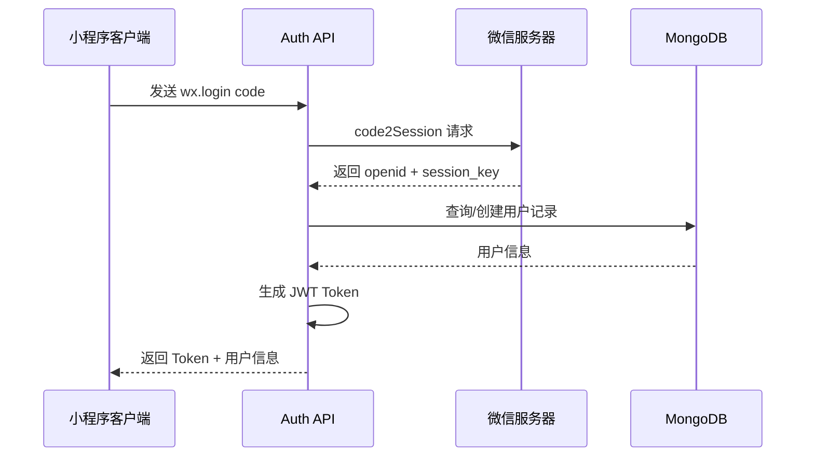
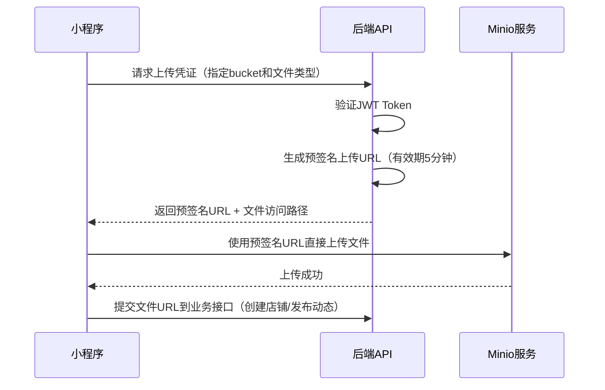
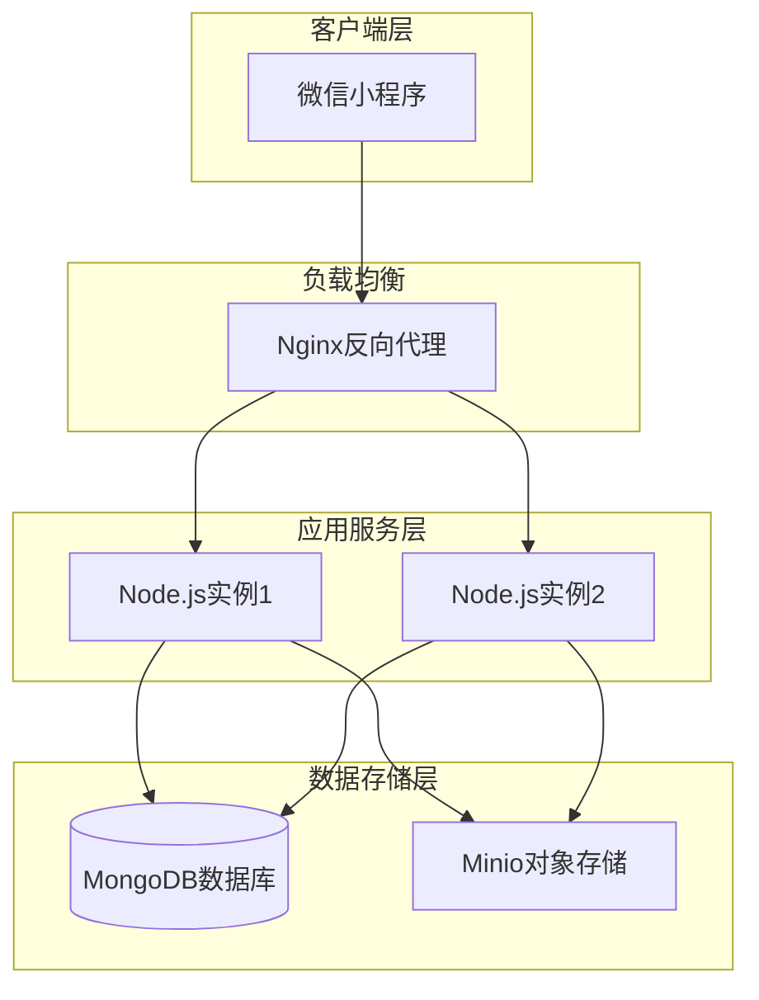

# 后端架构设计文档

## 项目概述

**项目名称**: 吃什么 (EatWhat)  
**后端技术栈**: Node.js + Express.js + MongoDB + Minio  
**架构风格**: RESTful API，前后端分离，模块化设计

## 架构分层

### 分层结构

后端采用经典的三层架构模式，职责清晰分离：

| 层级 | 职责 | 主要内容 |
|------|------|----------|
| **路由层 (Routes)** | 请求分发与路由映射 | 定义API端点，参数校验，调用控制器 |
| **控制层 (Controllers)** | 业务编排与响应处理 | 处理HTTP请求，调用服务层，格式化响应 |
| **服务层 (Services)** | 核心业务逻辑实现 | 业务规则，数据处理，事务控制 |
| **数据层 (Models)** | 数据持久化与模型定义 | Mongoose Schema，数据库操作 |

### 横切关注点

| 模块 | 用途 |
|------|------|
| **中间件 (Middlewares)** | JWT鉴权、错误处理、日志记录、请求限流 |
| **工具类 (Utils)** | 通用函数、常量定义、辅助方法 |
| **配置 (Config)** | 环境变量、数据库配置、第三方服务配置 |

## 核心模块划分

后端共划分为5个核心功能模块，购物车功能完全由前端Pinia负责，无需后端参与。

### 1. 用户认证模块 (Auth Module)

**业务职责**  
处理微信小程序用户的登录认证、Token管理和会话维护

**核心实体**  
User（用户）

**主要流程**



**数据模型要点**

| 字段 | 类型 | 说明 |
|------|------|------|
| openId | String | 微信唯一标识（索引） |
| nickName | String | 用户昵称 |
| avatarUrl | String | 头像地址 |
| createdAt | Date | 注册时间 |

**API设计**

| 端点 | 方法 | 描述 |
|------|------|------|
| /api/auth/login | POST | 微信登录换取Token |
| /api/auth/refresh | POST | 刷新Token |

---

### 2. 店铺模块 (Store Module)

**业务职责**  
管理店铺的创建、查询、更新，支持基于位置和时间的排序

**核心实体**  
Store（店铺）

**主要功能**

- 店铺列表查询（分页、排序）
- 店铺创建（UGC）
- 店铺详情获取
- 店铺信息更新

**数据模型要点**

| 字段 | 类型 | 说明 |
|------|------|------|
| name | String | 店铺名称 |
| description | String | 店铺简介 |
| coverImage | String | 门头照片URL（存储在Minio） |
| menuImages | Array<String> | 墙面菜单照片URL数组 |
| location | Object | 地理位置（经纬度） |
| creator | ObjectId | 创建者（关联User） |
| createdAt | Date | 创建时间 |
| updatedAt | Date | 最后更新时间 |

**排序策略**

- 按最近更新：使用 updatedAt 字段降序排列
- 按距离：基于用户当前经纬度计算距离（使用MongoDB地理空间查询）

**API设计**

| 端点 | 方法 | 描述 |
|------|------|------|
| /api/stores | GET | 获取店铺列表（支持排序、分页） |
| /api/stores | POST | 创建新店铺 |
| /api/stores/:id | GET | 获取店铺详情 |
| /api/stores/:id | PUT | 更新店铺信息 |

---

### 3. 菜单模块 (Menu Module)

**业务职责**  
处理菜品的众包录入、管理和互动（点赞/报错）

**核心实体**  
MenuItem（菜品项）

**主要功能**

- 菜品录入（关联店铺）
- 菜品列表查询（按店铺筛选）
- 菜品点赞/取消点赞
- 菜品报错标记

**数据模型要点**

| 字段 | 类型 | 说明 |
|------|------|------|
| storeId | ObjectId | 所属店铺（关联Store） |
| name | String | 菜品名称 |
| price | Number | 价格（单位：元） |
| creator | ObjectId | 录入者（关联User） |
| likeCount | Number | 点赞数（默认0） |
| reportCount | Number | 报错次数（默认0） |
| createdAt | Date | 录入时间 |

**互动记录实体**  
MenuInteraction（菜品互动记录）

| 字段 | 类型 | 说明 |
|------|------|------|
| menuItemId | ObjectId | 关联菜品 |
| userId | ObjectId | 操作用户 |
| type | Enum | 互动类型（like/report） |
| createdAt | Date | 操作时间 |

**业务规则**

- 同一用户对同一菜品只能点赞一次（通过查询 MenuInteraction 记录判断）
- 报错次数超过阈值时可标记菜品为"待审核"状态

**API设计**

| 端点 | 方法 | 描述 |
|------|------|------|
| /api/menus | POST | 录入新菜品 |
| /api/menus | GET | 获取菜品列表（按店铺筛选） |
| /api/menus/:id/like | POST | 点赞菜品 |
| /api/menus/:id/report | POST | 报错标记 |

---

### 4. 动态模块 (Moment Module)

**业务职责**  
管理用户发布的"好吃时刻"动态及其社交互动

**核心实体**  
Moment（动态）

**数据模型要点**

| 字段 | 类型 | 说明 |
|------|------|------|
| userId | ObjectId | 发布者（关联User） |
| storeId | ObjectId | 关联店铺（可选） |
| content | String | 动态文本内容 |
| images | Array<String> | 图片URL数组（存储在Minio） |
| likeCount | Number | 点赞数 |
| commentCount | Number | 评论数 |
| createdAt | Date | 发布时间 |

**互动实体**  
MomentLike（动态点赞）、MomentComment（动态评论）

**动态流策略**

- 按时间倒序排列
- 支持按关联店铺筛选
- 分页加载（每页10-20条）

**API设计**

| 端点 | 方法 | 描述 |
|------|------|------|
| /api/moments | GET | 获取动态流（分页） |
| /api/moments | POST | 发布新动态 |
| /api/moments/:id | GET | 获取动态详情 |
| /api/moments/:id/like | POST | 点赞动态 |
| /api/moments/:id/comments | GET | 获取评论列表 |
| /api/moments/:id/comments | POST | 发表评论 |

---

### 5. 文件存储模块 (Storage Module)

**业务职责**  
为客户端直传Minio提供临时凭证，管理文件访问权限

**存储方案**  
使用自建Minio对象存储服务，采用客户端直传架构

**文件分类策略**

| Bucket名称 | 用途 | 访问策略 |
|-----------|------|----------|
| store-images | 店铺相关图片（门头照、菜单照片） | 公开读，预签名写 |
| moment-images | 动态配图（用户上传的美食照片） | 公开读，预签名写 |
| avatars | 用户头像 | 公开读，预签名写 |

**客户端直传流程**



**预签名URL生成规则**

- 上传URL有效期：5分钟（防止链接泄露）
- 访问URL有效期：永久公开（图片可直接访问）
- 文件命名规则：`{userId}_{timestamp}_{randomString}.{ext}`

**安全策略**

| 措施 | 实现方式 |
|------|----------|
| 身份验证 | 请求预签名URL需携带有效JWT Token |
| 文件类型限制 | 仅允许图片格式（jpg/png/webp） |
| 文件大小限制 | 单张图片不超过5MB（通过预签名策略限制） |
| 上传频率限制 | 单用户每分钟最多获取10个上传凭证 |
| 防盗链 | Minio配置Referer白名单 |

**API设计**

| 端点 | 方法 | 描述 |
|------|------|------|
| /api/storage/upload-url | POST | 获取临时上传URL（需传bucket和fileType） |
| /api/storage/access-url | POST | 获取临时访问URL（针对私有资源，当前场景暂不需要） |

---

## 数据库设计要点

### 索引策略

| 集合 | 索引字段 | 目的 |
|------|---------|------|
| users | openId (unique) | 快速查找用户 |
| stores | location (2dsphere) | 地理位置查询 |
| stores | updatedAt | 按时间排序 |
| menuItems | storeId | 按店铺查询菜品 |
| moments | createdAt | 动态流时间排序 |
| moments | storeId | 按店铺筛选动态 |

### 关联关系说明

- User ← (1:N) → Store：一个用户可以创建多个店铺
- Store ← (1:N) → MenuItem：一个店铺包含多个菜品
- User ← (1:N) → Moment：一个用户可以发布多个动态
- Moment → Store (N:1)：一个动态可以关联一个店铺

---

## 技术实现要点

### JWT鉴权流程

- 登录成功后颁发Token（有效期7天）
- 客户端每次请求在Header中携带：`Authorization: Bearer {token}`
- 中间件验证Token有效性，解析出userId注入到请求上下文
- Token过期后通过refresh接口刷新

### 微信登录集成

- 调用微信官方API：`https://api.weixin.qq.com/sns/jscode2session`
- 需要配置：小程序appId、appSecret
- 返回openId后在数据库中查询或创建用户记录

### 图片上传方案

采用客户端直传Minio方案：

- 后端生成Minio预签名上传URL（使用Minio SDK的presignedPutObject方法）
- 客户端使用uni.uploadFile直接上传到预签名URL
- 优点：
  - 减轻后端服务器带宽压力
  - 上传速度快，用户体验好
  - 后端无需处理大文件流
- 后端职责：
  - 生成预签名URL时验证用户身份
  - 记录文件上传日志（用户、时间、文件路径）
  - 定期清理未关联业务的垃圾文件

### 地理位置查询

- MongoDB使用2dsphere索引支持地理空间查询
- 距离计算使用`$near`或`$geoNear`操作符
- 客户端传入当前经纬度，后端返回按距离排序的店铺列表

---

## 非功能需求

### 性能要求

| 指标 | 目标值 |
|------|--------|
| API响应时间 | P95 < 300ms |
| 图片上传速度 | 1MB图片 < 2s |
| 数据库查询 | 索引覆盖率 > 90% |

### 安全措施

- 所有API接口强制HTTPS
- JWT Token存储在客户端安全存储（不使用localStorage）
- 敏感操作（创建店铺、发布动态）需验证Token
- 图片上传防盗链（Referer校验）

### 可扩展性考虑

- 采用模块化设计，便于后续功能迭代
- 数据库预留扩展字段（使用Mongoose的灵活Schema）
- 接口版本化设计（如：/api/v1/stores）

---

## 部署架构建议



### 环境划分

| 环境 | 用途 | 特点 |
|------|------|------|
| 开发环境 (Dev) | 本地开发测试 | 单实例，开发数据库 |
| 生产环境 (Prod) | 线上服务 | 多实例，数据备份 |

---

## 项目目录结构建议

```
apps/api/
├── src/
│   ├── config/              # 配置文件
│   ├── middlewares/         # 中间件
│   ├── models/              # 数据模型
│   ├── controllers/         # 控制器
│   ├── services/            # 业务逻辑
│   ├── routes/              # 路由定义
│   ├── utils/               # 工具函数
│   └── app.js               # 应用入口
├── package.json
└── .env                     # 环境变量
```└── .env                     # 环境变量
