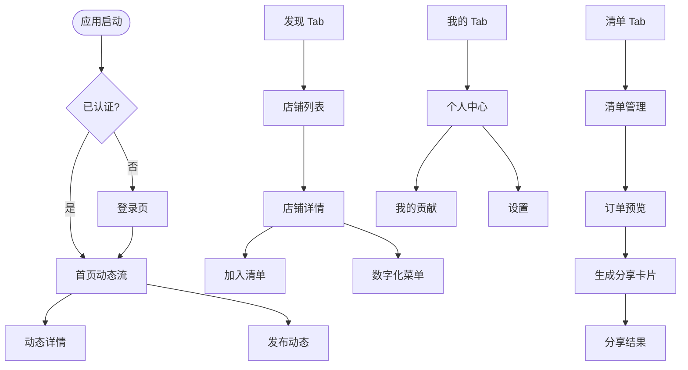
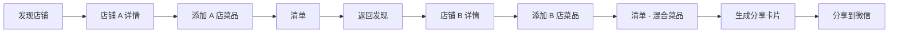
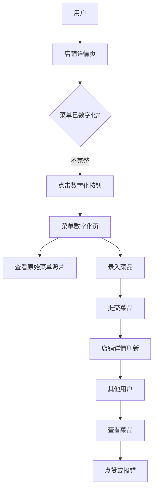

# 前端页面规划设计

## 设计概述

本设计文档定义「吃什么」微信小程序的页面架构、导航结构和组件组织方式。规划遵循 UniApp 最佳实践，对齐项目核心功能：店铺发现、菜单众包、跨店清单、分享生成、动态圈子。

## 设计目标

- 基于功能模块和用户旅程组织页面结构
- 设计直观的 Tab 导航覆盖主要功能
- 规划组件复用策略和共享 UI 元素
- 确保不同用户流程间的平滑过渡
- 支持无缝的跨店点餐体验

## 页面架构

### 导航结构

应用采用混合导航模式：TabBar 导航承载主要功能，栈式导航用于详情页和二级页面。

#### TabBar 页面（主导航）

| Tab 位置 | 页面路由 | 导航标题 | 图标表示 | 核心用途 |
|---------|---------|---------|---------|----------|
| 1 | /pages/home/index | 首页 | 首页图标 | 展示动态圈子和活动流 |
| 2 | /pages/discover/index | 发现 | 搜索图标 | 店铺发现和浏览 |
| 3 | /pages/cart/index | 清单 | 购物车图标 | 跨店订单清单管理 |
| 4 | /pages/profile/index | 我的 | 用户图标 | 个人中心和设置 |

### 页面清单与路由

#### 店铺模块页面

**发现页面**（TabBar）
- 路径：/pages/discover/index
- 用途：瀑布流浏览和搜索店铺
- 入口：TabBar 导航
- 关键功能：带排序选项的店铺列表、搜索功能

**店铺详情页**
- 路径：/pages/store/detail
- 用途：展示店铺信息、原始菜单照片和电子化菜单列表
- 入口：从发现页点击店铺卡片、动态中的店铺标签
- 导航参数：storeId
- 关键功能：店铺信息头部、原始菜单图片画廊、电子化菜单列表及加购操作

**创建店铺页**
- 路径：/pages/store/create
- 用途：UGC 功能 - 创建新店铺条目
- 入口：发现页的悬浮操作按钮
- 关键功能：多步骤表单，支持上传门头照和墙面菜单照片

#### 菜单众包模块页面

**菜单数字化页**
- 路径：/pages/menu/digitize
- 用途：参照原始菜单照片，众包录入菜品信息
- 入口：店铺详情页的操作按钮
- 导航参数：storeId, menuPhotoUrl
- 关键功能：分屏布局展示原图参照和录入表单、批量录入菜品

**菜品详情页**
- 路径：/pages/menu/item-detail
- 用途：展示菜品详情及互动选项
- 入口：从店铺详情页点击菜品
- 导航参数：itemId
- 关键功能：菜品信息、点赞/报错按钮、互动历史

#### 清单模块页面

**清单页**（TabBar）
- 路径：/pages/cart/index
- 用途：管理跨店订单清单，调整数量和备注
- 入口：TabBar 导航、加购成功提示
- 关键功能：按店铺分组、数量控制、条目备注、价格计算、生成分享卡片操作

**订单预览页**
- 路径：/pages/cart/preview
- 用途：生成分享卡片前的最终确认
- 入口：清单页的确认按钮
- 关键功能：汇总订单摘要、编辑选项、生成卡片操作

#### 分享生成模块页面

**分享卡片生成页**
- 路径：/pages/share/generate
- 用途：使用 Canvas 将清单内容渲染为可分享图片
- 入口：清单页或订单预览页的生成操作
- 导航参数：cartData（序列化）
- 关键功能：Canvas 渲染订单详情及二维码、保存到相册操作

**分享结果页**
- 路径：/pages/share/result
- 用途：展示生成的图片及分享选项
- 入口：生成成功后自动跳转
- 关键功能：图片预览、保存到相册按钮、分享到聊天选项

#### 动态模块页面

**首页动态流**（TabBar）
- 路径：/pages/home/index
- 用途：展示社区美食动态的社交流
- 入口：TabBar 导航（默认落地页）
- 关键功能：无限滚动动态流、带图片的动态卡片、点赞/评论操作

**发布动态页**
- 路径：/pages/moment/publish
- 用途：创建新的美食动态，带图片和店铺关联
- 入口：首页的悬浮操作按钮
- 关键功能：多图上传、店铺选择/标签、文本内容输入

**动态详情页**
- 路径：/pages/moment/detail
- 用途：查看单条动态的完整评论和互动
- 入口：从首页动态流点击动态卡片
- 导航参数：momentId
- 关键功能：完整动态内容、评论列表、点赞操作、评论输入

#### 用户模块页面

**个人中心页**（TabBar）
- 路径：/pages/profile/index
- 用途：用户个人中心和应用设置
- 入口：TabBar 导航
- 关键功能：用户信息展示、我的动态、我的贡献、设置入口

**我的贡献页**
- 路径：/pages/profile/contributions
- 用途：查看用户贡献的店铺和菜品
- 入口：个人中心页的链接
- 关键功能：创建的店铺列表、数字化的菜品、贡献统计

**设置页**
- 路径：/pages/profile/settings
- 用途：应用偏好设置和账号设置
- 入口：个人中心页的链接
- 关键功能：通知偏好、隐私设置、关于应用

#### 认证模块页面

**登录页**
- 路径：/pages/auth/login
- 用途：微信授权和用户认证
- 入口：未认证用户自动重定向
- 关键功能：微信登录按钮、隐私政策协议

## 页面流程图

### 主要用户旅程



### 跨店点餐流程



### 菜单众包流程



## 组件组织策略

### 共享组件结构

以下组件将作为跨页面复用的 UI 元素进行开发。

#### 布局组件

| 组件名称 | 使用范围 | 主要职责 |
|---------|---------|----------|
| AppTabBar | TabBar 页面 | 自定义 Tab 导航，支持角标 |
| PageContainer | 所有页面 | 标准页面容器，支持下拉刷新 |
| NavHeader | 二级页面 | 可自定义的导航栏（非 TabBar 页面） |
| EmptyState | 列表页面 | 展示空状态插图和引导操作 |

#### 业务组件

| 组件名称 | 使用范围 | 主要职责 |
|---------|---------|----------|
| StoreCard | 发现页、搜索结果 | 展示店铺预览，含图片、名称、距离 |
| MenuItemCard | 店铺详情、菜单数字化 | 展示菜品，含名称、价格、加购按钮 |
| CartItemRow | 清单页、订单预览 | 清单条目，含数量控制和备注输入 |
| MomentCard | 首页动态流、个人动态 | 动态卡片展示，含图片、内容、互动 |
| ImageUploader | 创建店铺、发布动态 | 多图上传，支持预览和删除 |
| PriceCalculator | 清单、订单预览 | 按店铺分项计价和总价计算 |
| ShareCanvas | 分享生成器 | 基于 Canvas 的订单卡片渲染 |

#### 交互组件

| 组件名称 | 使用范围 | 主要职责 |
|---------|---------|----------|
| LikeButton | 动态、菜品 | 切换点赞状态，带动画 |
| CommentInput | 动态详情 | 底部固定评论输入，支持 emoji |
| FloatingActionButton | 首页、发现页 | 主操作触发器（发布、创建） |
| StoreSelector | 发布动态 | 搜索并选择关联店铺 |
| QuantityControl | 菜品、清单 | 数量增减步进器 |
| SortFilter | 发现页 | 店铺列表的排序和筛选选项 |

### 组件通信模式

**父子组件通信**
- Props 用于父组件向子组件传递数据
- 自定义事件用于子组件向父组件交互

**跨组件状态**
- Pinia 存储用于清单状态、用户认证状态
- Vue-Query 用于服务端数据缓存和同步

**全局事件总线**
- 仅保留用于极少数场景如全局刷新触发
- 优先使用 Pinia 和 Vue-Query 而非事件总线

## 状态管理策略

### Pinia Store 模块

**Cart Store**（持久化）
- 职责：管理跨店清单项、数量、备注
- 持久化：LocalStorage 加密存储
- 核心 Actions：addItem, removeItem, updateQuantity, updateNote, clearCart

**User Store**（持久化）
- 职责：用户认证状态、个人信息、JWT token
- 持久化：Token 使用 SecureStorage，个人信息使用 LocalStorage
- 核心 Actions：login, logout, updateProfile, checkAuth

**App Store**（非持久化）
- 职责：全局 UI 状态、网络状态、系统信息
- 核心状态：加载指示器、Toast 消息、弹窗可见性

### Vue-Query 使用

**Query Keys 组织**
- stores：店铺列表和详情查询
- moments：动态流和详情查询
- menu：菜品和互动查询
- user：用户资料和贡献查询

**缓存策略**
- 店铺详情：缓存 5 分钟，stale-while-revalidate
- 动态流：缓存 1 分钟，焦点时自动刷新
- 菜品：缓存 10 分钟，贡献时失效
- 用户资料：缓存 30 分钟，手动失效

## 页面交互规范

### 加载状态

所有异步数据加载页面必须实现一致的加载状态：
- 初始加载：匹配内容结构的全页骨架屏
- 刷新加载：下拉刷新指示器
- 加载更多：无限滚动的底部加载动画
- 操作加载：表单提交的按钮加载状态

### 错误处理

跨页面标准化的错误展示：
- 网络错误：重试按钮和错误消息
- 空数据：EmptyState 组件展示插图
- 表单验证：字段下方内联错误消息
- 操作失败：Toast 通知显示错误描述

### 过渡动画

页面间导航过渡：
- 前进导航：从右侧滑入
- 后退导航：向右侧滑出
- 弹窗页面：从底部滑上
- TabBar 切换：淡入淡出

## 无障碍考虑

- 确保所有可交互元素的最小点击目标尺寸为 44px
- 为屏幕阅读器提供有意义的导航标题
- 使用语义化的颜色对比度确保文本可读性
- 在适当场景支持深色模式提升阅读舒适度

## 性能优化

- 瀑布流中的图片懒加载，使用占位符
- 超过 100 项的长列表实现虚拟滚动
- 使用 UniApp 分包加载优化首屏速度
- 预加载高频访问页面的关键资源

## 前端项目架构规划

### 目录结构设计

整体目录组织遵循 UniApp 规范，按照功能模块和职责分离原则组织代码。

```
apps/wechat/
├── pages/                    # 页面目录
│   ├── home/                # 首页动态流模块
│   │   └── index.vue
│   ├── discover/            # 发现店铺模块
│   │   └── index.vue
│   ├── cart/                # 清单模块
│   │   ├── index.vue
│   │   └── preview.vue
│   ├── profile/             # 个人中心模块
│   │   ├── index.vue
│   │   ├── contributions.vue
│   │   └── settings.vue
│   ├── store/               # 店铺相关页面
│   │   ├── detail.vue
│   │   └── create.vue
│   ├── menu/                # 菜单相关页面
│   │   ├── digitize.vue
│   │   └── item-detail.vue
│   ├── moment/              # 动态相关页面
│   │   ├── publish.vue
│   │   └── detail.vue
│   ├── share/               # 分享相关页面
│   │   ├── generate.vue
│   │   └── result.vue
│   └── auth/                # 认证页面
│       └── login.vue
├── components/              # 组件目录
│   ├── layout/             # 布局组件
│   │   ├── AppTabBar.vue
│   │   ├── PageContainer.vue
│   │   ├── NavHeader.vue
│   │   └── EmptyState.vue
│   ├── business/           # 业务组件
│   │   ├── StoreCard.vue
│   │   ├── MenuItemCard.vue
│   │   ├── CartItemRow.vue
│   │   ├── MomentCard.vue
│   │   ├── ImageUploader.vue
│   │   ├── PriceCalculator.vue
│   │   └── ShareCanvas.vue
│   └── interaction/        # 交互组件
│       ├── LikeButton.vue
│       ├── CommentInput.vue
│       ├── FloatingActionButton.vue
│       ├── StoreSelector.vue
│       ├── QuantityControl.vue
│       └── SortFilter.vue
├── stores/                  # Pinia 状态管理
│   ├── cart.js             # 购物车状态（持久化）
│   ├── user.js             # 用户状态（持久化）
│   └── app.js              # 应用全局状态
├── api/                     # API 接口层
│   ├── request.js          # 请求封装
│   ├── auth.js             # 认证接口
│   ├── store.js            # 店铺接口
│   ├── menu.js             # 菜单接口
│   ├── moment.js           # 动态接口
│   ├── storage.js          # 文件上传接口
│   └── interceptors.js     # 请求拦截器
├── composables/             # 组合式函数
│   ├── useAuth.js          # 认证逻辑
│   ├── useUpload.js        # 文件上传逻辑
│   ├── useLocation.js      # 地理位置
│   ├── useShare.js         # 分享功能
│   └── useQuery.js         # Vue-Query 封装
├── utils/                   # 工具函数
│   ├── constants.js        # 常量定义
│   ├── validators.js       # 表单验证
│   ├── formatters.js       # 数据格式化
│   ├── storage.js          # 本地存储封装
│   └── helpers.js          # 通用辅助函数
├── styles/                  # 样式文件
│   ├── variables.scss      # SCSS 变量
│   ├── mixins.scss         # SCSS 混入
│   ├── common.scss         # 公共样式
│   └── theme.scss          # 主题样式
├── static/                  # 静态资源
│   ├── images/             # 图片资源
│   ├── icons/              # 图标资源
│   └── fonts/              # 字体资源（如有）
├── App.vue                  # 应用入口组件
├── main.js                  # 应用入口文件
├── pages.json               # 页面配置
├── manifest.json            # 应用配置
└── uni.scss                 # UniApp 全局样式变量
```

### 技术架构设计

#### 核心技术栈

| 技术 | 版本要求 | 用途说明 |
|------|---------|----------|
| UniApp | 最新稳定版 | 跨端框架基础 |
| Vue 3 | 3.x | 核心框架（Composition API + Setup 语法） |
| Pinia | 2.x | 状态管理（替代 Vuex） |
| Vue-Query (TanStack Query) | 最新版 | 服务端状态管理和缓存 |
| SCSS | - | CSS 预处理器 |
| uni-icons | - | 图标库 |

#### 状态管理架构

**客户端状态（Pinia）**

购物车状态管理（stores/cart.js）
- 职责：管理跨店清单的完整生命周期
- 持久化方式：使用 Pinia 持久化插件存储到 LocalStorage
- 数据结构：按店铺分组的菜品列表，包含数量、备注、价格
- 关键约束：购物车完全由前端管理，后端不提供任何购物车接口
- 核心操作：添加菜品、删除菜品、更新数量、修改备注、清空清单、按店铺分组计算

用户状态管理（stores/user.js）
- 职责：用户认证信息、个人资料、登录状态
- 持久化方式：JWT Token 存储到 SecureStorage，个人资料存储到 LocalStorage
- 数据结构：用户 ID、昵称、头像、Token、登录时间戳
- 核心操作：微信登录、登出、更新资料、Token 刷新、认证状态检查

应用状态管理（stores/app.js）
- 职责：全局 UI 状态、网络状态、系统信息
- 持久化方式：运行时内存，不持久化
- 数据结构：加载状态、Toast 消息队列、Modal 显示状态、网络类型
- 核心操作：显示/隐藏加载、Toast 提示、Modal 控制、网络状态监听

**服务端状态（Vue-Query）**

查询配置策略
- 默认缓存时间：5 分钟
- 默认重试次数：3 次（网络错误）
- 自动后台刷新：页面获得焦点时
- 查询失效策略：基于 mutation 的智能失效

查询分类与缓存策略

| 查询类型 | Query Key 前缀 | 缓存时间 | 失效触发条件 |
|---------|---------------|---------|-------------|
| 店铺列表 | stores-list | 5 分钟 | 创建店铺、更新排序参数 |
| 店铺详情 | store-detail | 10 分钟 | 更新店铺、新增菜品 |
| 菜单列表 | menu-items | 10 分钟 | 数字化菜单、更新菜品 |
| 动态流 | moments-feed | 1 分钟 | 发布动态、删除动态 |
| 动态详情 | moment-detail | 5 分钟 | 点赞、评论 |
| 用户资料 | user-profile | 30 分钟 | 更新资料 |
| 贡献记录 | user-contributions | 5 分钟 | 创建店铺、数字化菜单 |

#### API 接口层架构

**请求封装（api/request.js）**

职责定义
- 封装 uni.request 为 Promise 风格
- 统一请求和响应格式
- 自动附加认证 Token
- 处理通用错误（401、403、500 等）

请求拦截器（api/interceptors.js）
- 自动添加 Authorization Header（从 User Store 获取）
- 自动添加通用请求头（platform、version、deviceId）
- 请求参数序列化和编码
- 请求日志记录（开发环境）

响应拦截器（api/interceptors.js）
- 统一响应数据结构解包（从 `{ code, data, message }` 提取 data）
- HTTP 状态码异常处理
- 业务错误码处理（根据 code 字段）
- Token 过期自动刷新或跳转登录
- 错误消息 Toast 自动提示

**文件上传架构（api/storage.js + composables/useUpload.js）**

上传流程设计
1. 前端调用后端接口获取 Minio 预签名上传 URL（有效期 5 分钟）
2. 前端使用 uni.uploadFile 直接上传文件到 Minio
3. 上传成功后获取文件访问 URL
4. 前端将文件 URL 提交到业务接口（如创建店铺、发布动态）

技术约束
- 后端不处理文件流，仅生成预签名 URL 和验证权限
- 支持多图片批量上传（最多 9 张）
- 自动压缩图片（宽度超过 1200px 时压缩）
- 支持上传进度回调
- 失败自动重试机制（最多 2 次）

接口模块划分

| 模块文件 | 职责范围 | 主要接口 |
|---------|---------|----------|
| api/auth.js | 用户认证 | 微信登录、Token 刷新、获取用户信息 |
| api/store.js | 店铺管理 | 店铺列表、店铺详情、创建店铺、搜索店铺 |
| api/menu.js | 菜单管理 | 菜单列表、数字化菜单、菜品互动（点赞/报错） |
| api/moment.js | 动态社交 | 动态流、动态详情、发布动态、点赞、评论 |
| api/storage.js | 文件上传 | 获取预签名 URL、上传到 Minio |

#### 组合式函数（Composables）架构

设计理念
- 封装可复用的业务逻辑
- 响应式状态管理
- 生命周期自动管理
- 易于测试和维护

核心 Composables

**useAuth（composables/useAuth.js）**
- 功能：统一认证逻辑
- 返回值：登录方法、登出方法、登录状态、用户信息
- 内部逻辑：调用微信登录 API、存储 Token、自动跳转

**useUpload（composables/useUpload.js）**
- 功能：文件上传流程封装
- 参数：最大数量、图片压缩选项
- 返回值：选择图片方法、上传方法、上传进度、上传状态
- 内部逻辑：调用 uni.chooseImage、获取预签名 URL、上传到 Minio

**useLocation（composables/useLocation.js）**
- 功能：地理位置获取和计算
- 返回值：当前位置、获取位置方法、计算距离方法
- 内部逻辑：调用微信位置 API、距离计算算法

**useShare（composables/useShare.js）**
- 功能：分享卡片生成和分享
- 返回值：生成卡片方法、保存到相册方法、分享状态
- 内部逻辑：Canvas 绘制、生成小程序码、保存图片

**useQuery（composables/useQuery.js）**
- 功能：封装 Vue-Query 的通用配置
- 返回值：配置好的 useQuery、useMutation hooks
- 内部逻辑：统一错误处理、加载状态、缓存配置

### 样式架构设计

#### SCSS 变量系统（styles/variables.scss）

颜色系统
- 主色调：品牌色、强调色
- 功能色：成功、警告、错误、信息
- 中性色：文本色、边框色、背景色（多层级）

尺寸系统
- 间距：基础间距单位（如 8rpx）及倍数
- 字号：标题、正文、辅助文字的字号梯度
- 圆角：统一的圆角尺寸
- 阴影：卡片阴影、浮动阴影

#### SCSS 混入（styles/mixins.scss）

通用混入
- 文本溢出省略（单行、多行）
- Flex 布局快捷方式
- 1px 边框解决方案
- 安全区域适配

#### 主题系统（styles/theme.scss）

主题切换支持
- 预留深色模式变量
- CSS 变量动态主题
- 主题切换过渡动画

### 性能优化策略

#### 分包加载

分包策略
- 主包：TabBar 页面 + 登录页 + 公共组件
- 店铺分包：店铺详情、创建店铺、菜单数字化
- 动态分包：发布动态、动态详情
- 分享分包：分享卡片生成、分享结果

预加载配置
- 首页加载时预加载店铺分包
- 打开店铺详情时预加载分享分包

#### 图片优化

懒加载策略
- 瀑布流使用懒加载组件
- 图片进入可视区域前加载占位图
- 支持渐进式加载

压缩策略
- 上传前自动压缩（质量 80%）
- 列表页使用缩略图
- 详情页使用原图或中等尺寸图

#### 列表优化

虚拟滚动
- 动态流超过 100 条时启用虚拟滚动
- 店铺列表超过 50 条时启用虚拟滚动

分页加载
- 每页 20 条数据
- 触底自动加载下一页
- 加载状态提示

#### 缓存策略

数据缓存
- Vue-Query 自动缓存服务端数据
- Pinia 持久化客户端状态
- 图片缓存由 UniApp 自动管理

预加载
- 首页预加载常用接口数据
- 用户行为预测预加载

### 错误处理与监控

#### 错误分类处理

网络错误
- 无网络：提示用户检查网络
- 超时：自动重试 + 提示
- 服务端错误：友好错误提示

业务错误
- 表单验证错误：字段级错误提示
- 权限错误：跳转登录或提示
- 数据不存在：空状态页面

系统错误
- JS 运行时错误：捕获并上报
- 白屏错误：降级处理

#### 日志与监控

日志收集
- 开发环境：console 输出详细日志
- 生产环境：关键操作日志上报

性能监控
- 页面加载时间
- 接口响应时间
- 用户操作路径

### 开发规范

#### 命名规范

文件命名
- 组件文件：PascalCase（如 StoreCard.vue）
- 页面文件：kebab-case（如 store-detail.vue）
- JS 文件：camelCase（如 useAuth.js）
- 样式文件：kebab-case（如 common.scss）

代码命名
- 组件名：PascalCase
- 变量/函数：camelCase
- 常量：UPPER_SNAKE_CASE
- CSS 类名：kebab-case（BEM 风格可选）

#### 组件开发规范

Vue 3 组合式 API
- 统一使用 `<script setup>` 语法
- 逻辑抽离到 composables
- Props 使用 TypeScript 风格的运行时声明
- Emits 显式声明

组件职责单一
- 每个组件专注单一功能
- 超过 300 行代码考虑拆分
- 业务逻辑抽离到 composables

#### API 调用规范

统一使用 Vue-Query
- 查询操作使用 useQuery
- 变更操作使用 useMutation
- 避免直接调用 API 函数（除非特殊场景）

错误处理
- 每个 API 调用都要有错误处理
- 使用 Vue-Query 的 onError 回调
- 关键操作显式 try-catch

### 测试策略

#### 单元测试

测试范围
- 工具函数（utils）
- Composables
- Pinia Stores
- 复杂组件逻辑

测试工具
- Vitest 作为测试运行器
- Vue Test Utils 测试组件

#### 集成测试

测试范围
- 关键用户流程（登录、下单、分享）
- API 交互

#### E2E 测试

测试范围
- 核心业务流程端到端验证

测试工具
- 微信开发者工具自动化测试

## 设计约束

- 所有页面路由必须在 pages.json 中注册
- TabBar 最多 5 个 Tab（微信小程序规范限制）
- 导航栈深度不应超过 10 层，避免内存问题
- 图片上传必须符合微信尺寸限制和 Minio 存储配额
- 购物车功能完全由前端 Pinia 管理，后端不提供购物车接口
- 文件上传采用客户端直传 Minio，后端仅提供预签名 URL- Navigation stack depth should not exceed 10 levels to prevent memory issues
